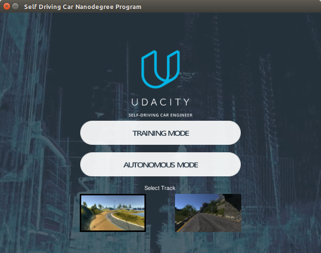
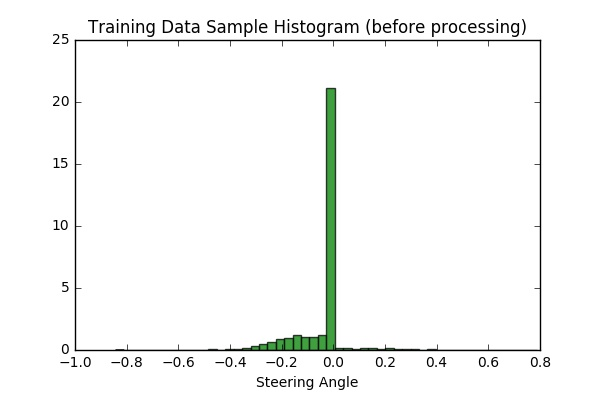
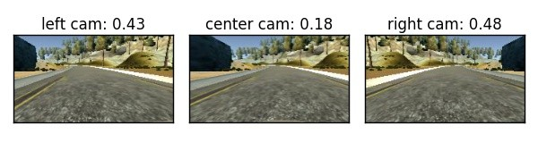
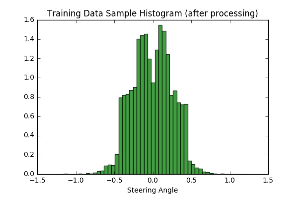
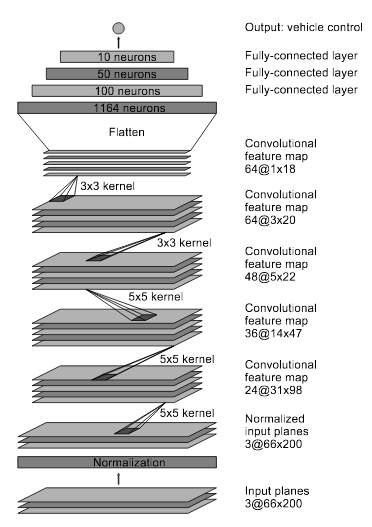

# Udacity Self-Driving Car Nanodegree, Behavioural Cloning Project (Project 3)

## Introduction:

*The objective of the project is to train a model to drive a car autonomously on a simulated track. 
The ability of the model to drive the car is learned from cloning the behaviour of a human driver.
Training data is gotten from examples of a human driving in the simulator, then fed into a deep learning network which learns the response (steering angle) for every encountered frame in the simulation. In other words, the model is trained to predict an appropriate steering angle for every frame while driving. The model is then validated on a new track to check for generalization of the learned features for performing steering angle prediction.*

This project is influenced by [nvidia paper](https://images.nvidia.com/content/tegra/automotive/images/2016/solutions/pdf/end-to-end-dl-using-px.pdf), [comma.ai paper](https://arxiv.org/pdf/1608.01230v1.pdf) and [vivek's blog](https://chatbotslife.com/using-augmentation-to-mimic-human-driving-496b569760a9#.5dpi87xzi) which I consulted while working on my solution. The [Keras Deep Learning library](https://keras.io/) was used with [Tensorflow](https://www.tensorflow.org/) backend, to perform deep learning operations.

## Outline

**1. Data Recording**

**2. Data Processing**

**3. Model Training**

**4. Model Testing**

**5. Conclusion**

## 1. Data Recording

The simulator has two modes - Training mode and Autonomous mode. Training mode is used to collect training data by driving through the tracks and recording the driving data in a folder. The Autonomous mode is used to test a trained model. 

Udacity provided a set of training data (24,108 datasets) which can be downloaded with the simulator. I thought that the Udacity datasets might not be enough so I recorded my own training data (104,145 datasets) and would use the Udacity datasets for validation. Plotting an histogram of 10,000 samples of the training data shows that the data from track 1 has more 0 and left steering angles because of the nature of the track, so our processing step will also include data augmentation and balancing, in other to prevent our model from being biased towards driving straight and left turns.

## 2. Data processing

Data processing is done to allow our model to be able to easily work with raw data for training. In this project, the data processing is built into a generator (keras *fit_generator*) to allow for real-time processing of the data. The advantage here is that, in the case that we are working with a very large amount of data, the whole dataset is not loaded into memory, we can therefore work with a manageable batch of data at a time. Hence the generator is run in parallel to the model, for efficiency.

The following are the processing steps carried on the data:

1. **Randomly choose from center, left and right  camera images:** The simulator provides three camera views namely; center, left and right views. Since we are required to use only one camera view, we choose randomly from the three views. While using the left and right images, we add and subtract 0.25 to the steering angles respectively to make up for the camera offsets [[1]](https://chatbotslife.com/using-augmentation-to-mimic-human-driving-496b569760a9#.5dpi87xzi).

2. **Translate image (Jitter) and compensate for steering angles:** Since the original image size is 160x320 pixels, we randomly translate image to the left or right and compensate for the translation in the steering angles with 0.008 per pixel of translation. We then crop a region of interest of 120x220 pixel from the image. *Note that I only translated in the horizontal direction for my solution.*

3. **Randomly flip image:** In other to balance left and right images, we randomly flip images and change sign on the steering angles. The following figure shows the view from the left, right and center cameras after been jittered, cropped, and angles corrected. The right camera view has been flipped so it looks like a left camera image.

4. **Brightness Augmentation** We simulate different brightness occasions by converting image to HSV channel and randomly scaling the V channel.

Plotting a sample of 10,000 processed images shows a more balanced distribution of the steering angles after processing:

## 3. Model Training

The [Nvidia model][1] was adopted for training, because it gave better result after experimenting with other kinds of model (e.g. comma.ai). The network consists of 9 layers, including a normalization layer, 5 convolutional layers and 3 fully connected layers. Converse to the Nvidia model, input image was split to HSV planes before been passed to the network. 

Image was normalized in the first layer. According to the Nvidia paper, this enables normalization also to be accelerated via GPU processing.

Convolution were used in the first three layers with 2x2 strides and a 5x5 kernel, and non-strided convolution with 3x3 kernel size in the last two convolutional layers.

The convolutional layers were followed by three fully connected layers which then outputs the steering angle.

Overfitting was reduced by using aggressive Dropout (0.2) on all the layers and L2 Regularization (0.001) on the first layer. This turned out to be a good practice as the model could generalize to the second track, without using it for training.

An Adam optimizer was used for optimization. This requires little or no tunning as the learning rate is adaptive. In addition, checkpoint and early stop mechanisms were used during training to chose best training model by monitoring the validation loss and stopping the training if the loss does not reduce in three consecutive epochs.

Though there was more than 100,000 training data, each epoch consisted of 24,064 samples. This made the training more tractable, and since we were using a generator, all of the training data was still used in training, however at different epochs.

*To reiterate, self-recorded data was used for training, while the Udacity-provided data was used for validation during training.*

## 4. Model Testing

The trained model was tested on the first track. This gave a good result, as the car could drive on the track smoothly.

[See Track 1 test result video here](https://youtu.be/PAouMCtEhWY)

Additionally, to test for generalization, the model was tested on the second track. It is good to note that the model never trained on samples from this track, yet it drives successfully on it.

[See Track 2 test result video here](https://youtu.be/hOsUNo5g3A4)

## 5. Conclusion

A deep learning model to drive autonomously on a simulated track was trained by using a human behaviour-sampled data. The model, which includes 5 layers of convolution and 3 more fully connected layers, was able to learn by cloning human behaviour, and was able to generalize response to a new test track. Though the model only controls the steering angle, it can also be extended to control throttle and brake.

### Notes

The following are personal notes from working on this project:

1. **Data processing is as important as learning process:** I realized that, perhaps the most important part of this project was to come up with a data processing that anticipates test cases and generalize, hence the use of jittering and brightness augmentation. Once I was able to train on the Nvidia model, it was also easy to work on the comma.ai model, which also gave a satisfactory result with the same data processing.
1. **Amount of data counts:** More data would mostly improve the learning efficiency. I could easily see an improvement when I had a lot of data to train from, and was able to validate against the Udacity dataset.
1. **Some processing which I didn't find useful:** Though some other people used these methods, they didn't really make a difference in my case. Examples are, vertical translation, perturbing the steering angles around 0 by adding some uniform noise, and using a square sized input.

[1]: https://arxiv.org/pdf/1604.07316v1.pdf "End to End Learning for Self-Driving Cars"
